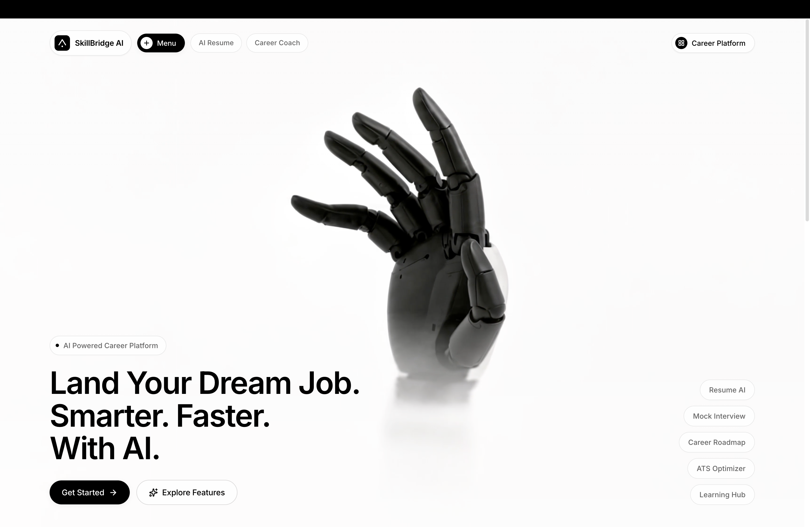
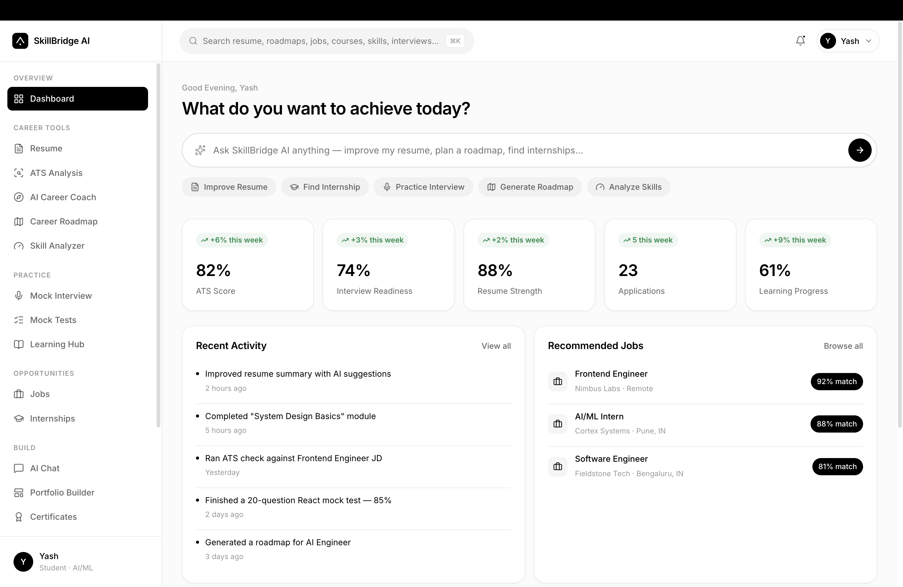
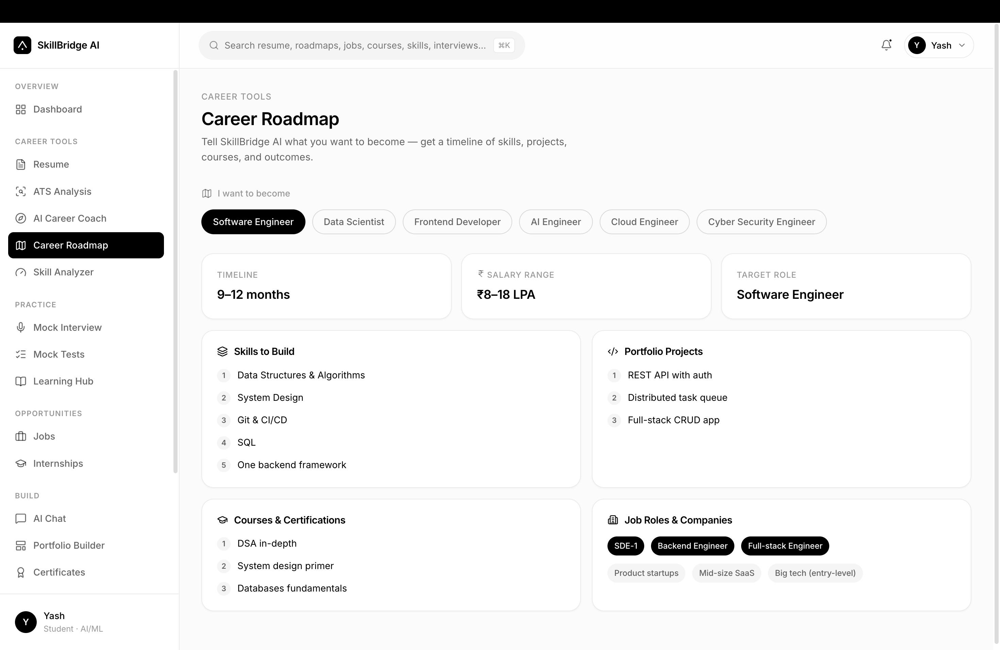
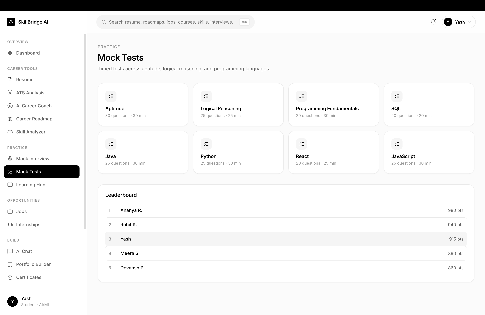
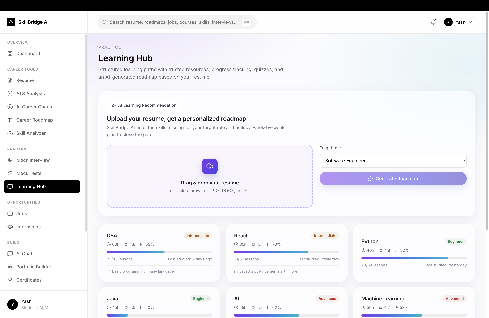

# 🚀 SkillBridge AI

  <strong>Build Skills. Beat the ATS. Get Career-Ready.</strong>

  An AI-powered career platform designed to help students and job seekers improve their resumes, identify skill gaps, prepare for interviews, and build personalized career paths.

---

## 🌟 About

SkillBridge AI brings essential career tools together in one platform.

It helps users move from:

**Current Skills → Skill Gap → Learning → Resume → Interview Preparation → Career Ready 🚀**

---

## ✨ Features

### 🤖 AI Resume Builder

Create professional resumes based on your education, skills, projects, experience, certifications, and career goals.

### 📊 ATS Resume Analyzer

Analyze your resume and receive insights such as:

- 📈 ATS Score
- 🔑 Keyword Analysis
- 🧠 Skill Analysis
- ⚠️ Missing Skills
- 📝 Resume Improvement Suggestions
- 🎯 ATS Optimization

### 🎯 Skill Gap Analysis

Identify the difference between your current skills and the skills required for your target career.

### 🗺️ Career Roadmap

Get a structured roadmap based on your target role, current skills, and career goals.

### 🎤 AI Mock Interview

Practice technical, HR, behavioral, and role-specific interview questions.

### 📚 AI Learning Hub

Discover learning resources based on your target career and identified skill gaps.

### 💡 Career Recommendations

Get personalized recommendations for:

- Skills to learn
- Projects to build
- Learning resources
- Career paths
- Interview preparation

---

## 🧠 How It Works

SkillBridge AI follows a simple process to help users move from their current skills to career readiness.

### 1️⃣ Build Your Profile

Add your education, skills, projects, experience, certifications, and target career.

### 2️⃣ Analyze Your Resume

Upload or create your resume and use AI-powered analysis to evaluate its quality, skills, keywords, and ATS compatibility.

### 3️⃣ Identify Skill Gaps

SkillBridge AI compares your current skills with the skills required for your target career and identifies areas that need improvement.

### 4️⃣ Get Your Career Roadmap

Receive a structured roadmap showing what skills to learn, which projects to build, and what steps to take next.

### 5️⃣ Learn & Improve

Use the Learning Hub to discover relevant learning resources based on your skill gaps and career goals.

### 6️⃣ Prepare for Interviews

Practice technical, HR, and behavioral interviews with AI-powered mock interview preparation.

### 7️⃣ Become Career Ready 🚀

Continuously improve your skills, resume, projects, and interview performance until you're ready to pursue your target opportunities.

### 🔄 The SkillBridge Journey

~~~text
👤 YOUR PROFILE
       ↓
📄 RESUME ANALYSIS
       ↓
📊 ATS SCORE
       ↓
🎯 SKILL GAP ANALYSIS
       ↓
🗺️ CAREER ROADMAP
       ↓
📚 PERSONALIZED LEARNING
       ↓
🎤 MOCK INTERVIEW
       ↓
🚀 CAREER READY
~~~

---

## 🛠️ Tech Stack

### Frontend

- ⚛️ **React.js**
- ⚡ **Vite**
- 🟨 **JavaScript**
- 🌐 **HTML5**
- 🎨 **CSS3**

### Tools

- 🟢 **Node.js**
- 📦 **npm**
- 🔧 **Git**
- 🐙 **GitHub**
- 💻 **Visual Studio Code**

### AI & Intelligence

- 🤖 **AI-powered Resume Analysis**
- 📊 **ATS Optimization**
- 🎯 **Skill Gap Analysis**
- 💡 **Career Recommendations**
- 📚 **Personalized Learning**
- 🎤 **AI Interview Preparation**

---

## 🚀 Installation

### Prerequisites

Before running SkillBridge AI, make sure you have:

- 🟢 Node.js
- 📦 npm
- 🔧 Git

### 1. Clone the Repository

~~~bash
git clone https://github.com/yashkunjir2006-commits/skillbridge-ai.git
~~~

### 2. Navigate to the Project

~~~bash
cd skillbridge-ai
~~~

### 3. Install Dependencies

~~~bash
npm install
~~~

### 4. Start the Development Server

~~~bash
npm run dev
~~~

### 5. Open the Application

Open the URL displayed in your terminal.

Usually:

~~~text
http://localhost:5173
~~~

---
## 📸 Project Preview

### 🏠 SkillBridge AI Landing Page

A clean and modern interface providing access to AI-powered career tools.

---

### 📊 Resume & ATS Analysis

Analyze resumes and identify areas that can be improved for better ATS compatibility.

---

### 🎯 Career Development

Use skill-gap analysis, career roadmaps, and personalized recommendations to plan your career journey.

---

### 🎤 Interview Preparation

Prepare for interviews with AI-powered interview practice.

---

### 📚 Learning Hub

Discover relevant learning resources based on your career goals and skill gaps.
---

## 🎯 Target Users

SkillBridge AI is designed for:

- 🎓 College Students
- 💼 Job Seekers
- 👨‍💻 Developers
- 🤖 AI/ML Learners
- 📊 Data Science Students
- 🚀 Early-Career Professionals
- 🔄 Professionals Looking to Reskill

---

## 🔮 Roadmap

### Phase 1 — Core Platform

- [x] AI Career Platform UI
- [x] AI Resume Builder
- [x] ATS Resume Analysis
- [x] Skill Gap Analysis
- [x] Career Roadmap
- [x] AI Mock Interview
- [x] Learning Hub

### Phase 2 — Advanced Intelligence

- [ ] Advanced Resume Intelligence
- [ ] Job Description vs Resume Matching
- [ ] Improved ATS Scoring
- [ ] Personalized Course Recommendations
- [ ] AI Career Mentor
- [ ] Interview Performance Analytics

### Phase 3 — Career Ecosystem

- [ ] Job Recommendation Engine
- [ ] LinkedIn Profile Analyzer
- [ ] GitHub Profile Analyzer
- [ ] Portfolio Analyzer
- [ ] User Authentication
- [ ] Personalized Dashboard
- [ ] Career Progress Tracking

---

## 🎯 Vision

SkillBridge AI aims to become an intelligent career companion that helps users continuously improve their career readiness.

### 🚀 Career Readiness Journey

~~~text
SKILLS
   ↓
PROJECTS
   ↓
RESUME
   ↓
ATS SCORE
   ↓
SKILL GAP ANALYSIS
   ↓
LEARNING PATH
   ↓
MOCK INTERVIEW
   ↓
JOB READY 🚀
~~~

The goal is not simply to help users apply for jobs.

The goal is to help users become **ready for the jobs they want**.

---

## 🌐 Live Demo

🚧 **Coming Soon**

---

## 🔐 Security

Never commit:

- 🔑 API keys
- 🔒 Passwords
- 🎫 Access tokens
- 🔐 Private credentials
- ⚙️ Environment secrets

Use `.env` files for sensitive configuration and make sure they are included in `.gitignore`.

---

## 👨‍💻 Developer

### Yash Kunjir

**Computer Science Student | AI/ML & Web Development**

#### Interested In

- 🤖 Artificial Intelligence
- 🧠 Machine Learning
- 💻 Web Development
- 🎨 Modern UI/UX
- 🚀 Career Technology

---

## ⭐ Support

If you find **SkillBridge AI** interesting, please consider giving the repository a ⭐ on GitHub.

Your feedback and suggestions are always welcome.

---

  <strong>🚀 SkillBridge AI</strong>
   
  Build Skills. Beat the ATS. Get Career-Ready.

